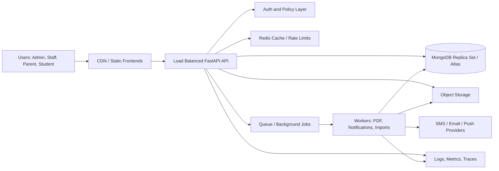

# Executive Summary

## Overall Assessment

Smart M Hub has a strong functional foundation for a school management platform. It already includes multi-school concepts, role-aware portals, JWT authentication, MongoDB persistence, student management, staff management, finance, attendance, examinations, CBC assessment reports, support, uploads, school registration, and a super admin dashboard.

The current platform is suitable for continued product development and controlled small-to-medium pilots. It is not yet ready for large-scale enterprise SaaS deployment across 1,000+ schools without architecture hardening.

The largest risk is concentration of backend logic in a single large `backend/server.py` module. This increases the cost of review, testing, authorization auditing, and safe feature delivery. The second major risk is scale readiness: several endpoints fetch large result sets into memory, file storage is local, background work is synchronous, and observability is limited.

## Production Readiness Verdict

Status: Not yet enterprise-production-ready at target scale.

Recommended posture:

- Continue controlled pilots.
- Avoid onboarding thousands of schools until the critical roadmap items are complete.
- Prioritize security, authorization, pagination, indexes, file storage, queues, and observability before aggressive scale-up.

## Key Strengths

- Clear product scope and broad SMIS coverage.
- Existing multi-tenant field strategy using `school_id`.
- Existing JWT authentication, password hashing, role normalization, and school subscription checks.
- Existing security/audit log usage in several workflows.
- Existing super admin dashboard and platform oversight concepts.
- CBC module is moving toward a template-driven design.
- Existing upload validation for type, category, and size.
- Startup index creation exists for several collections.

## Key Risks

- Backend domain logic is too centralized.
- Authorization checks are duplicated and inconsistent across endpoints.
- Several endpoints use large `to_list(...)` calls without pagination.
- File uploads are stored on the backend filesystem, which blocks horizontal scaling.
- No background job system for bulk reports, notifications, PDFs, imports, and analytics.
- Response formats and endpoint naming are inconsistent.
- Test coverage is low relative to platform size.
- No formal API versioning or compatibility policy.
- No production-grade monitoring, tracing, alerting, or SLO model.

## High-Level Target Architecture

## Priority Summary

| Priority | Theme | Impact | Effort |
|---|---|---:|---:|
| Critical | Centralize authorization and tenant scoping | Very High | Medium |
| Critical | Add pagination and query limits everywhere | Very High | Medium |
| Critical | Move uploads to object storage | Very High | Medium |
| Critical | Add background workers and queue | Very High | High |
| Critical | Split backend into domain routers/services | Very High | High |
| High | Add refresh/session management | High | Medium |
| High | Standardize API responses and versioning | High | Medium |
| High | Add observability stack | High | Medium |
| High | Add CI/CD and deployment automation | High | Medium |

## Recommended Delivery Strategy

Do not rewrite the product. Use incremental hardening:

1. Safety foundation: authorization, pagination, indexes, upload storage, rate limiting.
2. Operational foundation: logs, metrics, health checks, CI/CD, backups.
3. Architecture foundation: routers, services, repositories, background jobs.
4. Product excellence: consistent UX, reporting engine, notification pipeline.
5. Growth foundation: analytics, AI readiness, mobile API contracts, future modules.
