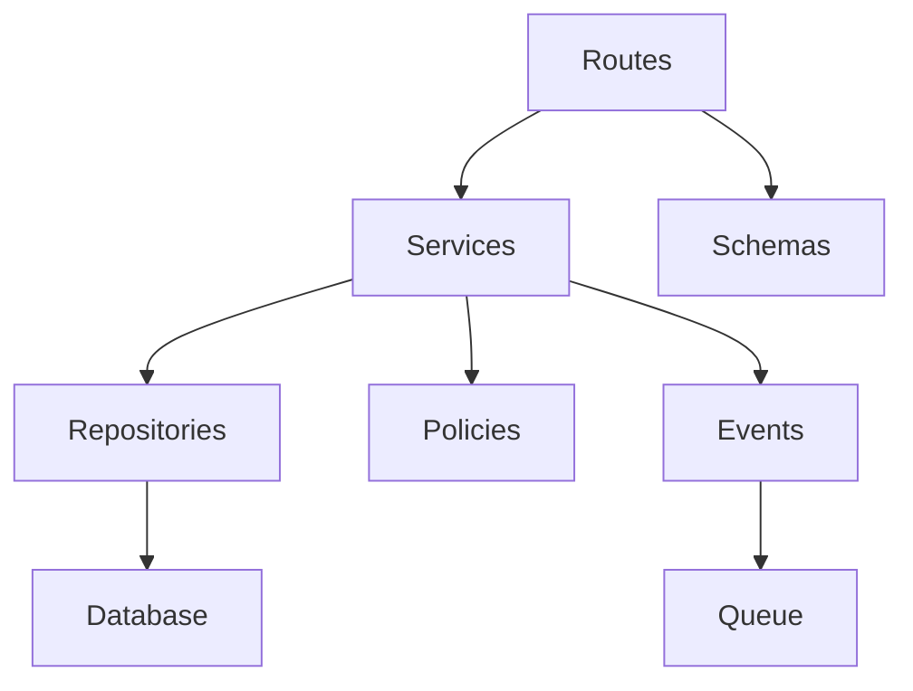

# System Architecture Review

## Current Structure

Current major areas:

- `backend/server.py`: main FastAPI application, routes, request models, helper functions, business logic, index creation.
- `backend/auth.py`: authentication helpers, JWT handling, password hashing, current-user dependency.
- `backend/models.py`: Pydantic models and enums.
- `backend/routes/platform.py`: super admin/platform routes.
- `frontend/src`: school-facing React app.
- `super-admin-dashboard/src`: platform admin React app.
- `docs`: existing documentation and audit artifacts.

## Findings

### Strengths

- The platform has a clear separation between school-facing frontend and super-admin dashboard.
- Backend uses FastAPI and Motor async MongoDB driver, which is appropriate for high-concurrency I/O workloads.
- Central `get_current_user` dependency is already used widely.
- Helper functions exist for role normalization, school identity, uploads, fee receipts, and class classification.

### Risks

- `backend/server.py` is too large and has too many responsibilities.
- Request DTOs, domain rules, persistence logic, response formatting, and route handlers live together.
- Several helper functions are global and domain-specific, making ownership unclear.
- Route naming and response style vary by module.
- Super admin routes are partially modularized, but most school routes are not.
- Configuration is split across code defaults and environment variables without a typed settings object.

## Recommended Target Backend Layout

```text
backend/
  app/
    main.py
    core/
      config.py
      database.py
      security.py
      logging.py
      pagination.py
      errors.py
    auth/
      routes.py
      service.py
      schemas.py
      policies.py
    schools/
    students/
    staff/
    finance/
    attendance/
    exams/
    cbc/
    notifications/
    uploads/
    platform/
    common/
      models.py
      serialization.py
      ids.py
```

## Recommended Dependency Direction



Rules:

- Routes should validate transport concerns and call services.
- Services should own business rules.
- Repositories should own MongoDB queries.
- Policies should own authorization decisions.
- Events should trigger side effects such as notifications and report generation.

## Configuration Recommendations

Introduce a typed settings module:

- `APP_ENV`
- `MONGO_URL`
- `DB_NAME`
- `SECRET_KEY`
- `FRONTEND_URL`
- `ALLOWED_ORIGINS`
- `UPLOAD_BACKEND`
- `OBJECT_STORAGE_BUCKET`
- `REDIS_URL`
- `JWT_ACCESS_MINUTES`
- `JWT_REFRESH_DAYS`
- `RATE_LIMIT_*`

Impact: High.

Effort: Medium.

Migration: Keep current env names and map them into the new settings object.

## Priority Recommendations

| Recommendation | Priority | Impact | Effort |
|---|---|---:|---:|
| Split `server.py` into domain routers and services | Critical | Very High | High |
| Add typed settings object | High | High | Medium |
| Create shared pagination and response utilities | High | High | Medium |
| Move database access into repositories | Medium | High | High |
| Add domain event system | Medium | High | Medium |

## Migration Considerations

- Preserve existing route paths initially.
- Move one module at a time, starting with staff, CBC, uploads, and finance.
- Add tests before moving complex endpoints.
- Keep `server.py` as a compatibility entry point until modules are fully extracted.
