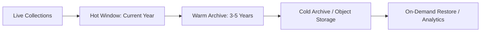

# Database Review

## Current Model

Smart M Hub uses MongoDB with UUID string `id` fields and Mongo `_id` fields. Most tenant-scoped collections include `school_id`.

Major collections include:

- `schools`
- `users`
- `students`
- `staff`
- `payments`
- `finance_transactions`
- `attendance`
- `attendance_summaries`
- `exams`
- `results`
- `assessment_templates`
- `assessment_reports`
- `assessment_results`
- `announcements`
- `support_tickets`
- `audit_logs`
- `platform_invoices`
- `notifications`
- `fee_structures`
- `timetable`
- `inventory`

## Strengths

- `school_id` is present in most business collections.
- Startup index creation exists.
- UUID string IDs provide route-stable IDs independent from Mongo `_id`.
- Historical collections exist or are emerging for student history and report history.

## Risks

- Some collections and routes are not guaranteed to be consistently indexed for the expected query patterns.
- Several high-volume routes fetch large result sets into memory.
- Compound indexes need stricter alignment with actual filters and sort fields.
- No documented archival strategy for attendance, logs, notifications, finance, or reports.
- No visible backup/restore runbook.
- Startup index creation is useful, but index migrations should be controlled outside app startup for large production datasets.

## Critical Query Patterns

Expected high-volume access patterns:

- Students by `school_id`, `class_name`, `status`, `approval_status`.
- Attendance by `school_id`, `date`, `class_name`, `student_id`.
- Finance transactions by `school_id`, `created_at`, `status`, `transaction_type`.
- Results by `school_id`, `student_id`, `exam_id`, `class_name`.
- CBC reports by `school_id`, `student_id`, `exam_id`, `status`, `academic_year`, `term`.
- Audit logs by `school_id`, `timestamp`, `action`.
- Notifications by `school_id`, `user_id` or `student_id`, `read`, `created_at`.

## Recommended Indexes

| Collection | Index | Reason |
|---|---|---|
| `students` | `{school_id: 1, class_name: 1, status: 1, approval_status: 1}` | Class lists and active learners |
| `students` | `{school_id: 1, admission_number: 1}` unique/sparse | Lookup and parent linking |
| `users` | `{school_id: 1, email: 1}` unique/sparse | Login and staff management |
| `users` | `{school_id: 1, role: 1, status: 1}` | Staff/user lists |
| `attendance` | `{school_id: 1, date: -1, class_name: 1}` | Daily/class attendance |
| `attendance` | `{school_id: 1, student_id: 1, date: -1}` | Student attendance history |
| `payments` | `{school_id: 1, student_id: 1, created_at: -1}` | Student fee views |
| `payments` | `{school_id: 1, approval_status: 1, status: 1, created_at: -1}` | Finance dashboards |
| `finance_transactions` | `{school_id: 1, approval_status: 1, date: -1}` | Finance ledgers |
| `results` | `{school_id: 1, exam_id: 1, student_id: 1}` | Exam result lookup |
| `assessment_reports` | `{school_id: 1, student_id: 1, status: 1, created_at: -1}` | Portal report history |
| `assessment_reports` | `{school_id: 1, exam_id: 1, class_name: 1, status: 1}` | Bulk publish/review |
| `audit_logs` | `{school_id: 1, timestamp: -1}` | Auditing |
| `notifications` | `{school_id: 1, recipient_id: 1, read: 1, created_at: -1}` | Notification inbox |

## Archival Strategy

Recommendations:

- Keep academic and finance history permanently.
- Archive high-volume operational data by year/term.
- Never delete published reports, payments, or audit logs unless retention policy allows.
- Use summary collections for dashboards instead of scanning raw records.

## Backup And Recovery

Minimum requirements:

- Daily automated backups.
- Point-in-time recovery.
- Monthly restore test.
- Backup encryption.
- Separate production and staging backup policies.
- Documented RPO/RTO.

Recommended targets:

- RPO: 15 minutes or less for production.
- RTO: 2 hours or less for critical school operations.

## Priority Recommendations

| Recommendation | Priority | Impact | Effort |
|---|---|---:|---:|
| Add pagination and projections for all large reads | Critical | Very High | Medium |
| Align compound indexes with real queries | Critical | Very High | Medium |
| Move index migrations out of app startup for production | High | High | Medium |
| Add archive policy for attendance/logs/notifications | High | High | Medium |
| Add backup and restore runbook | High | High | Medium |
