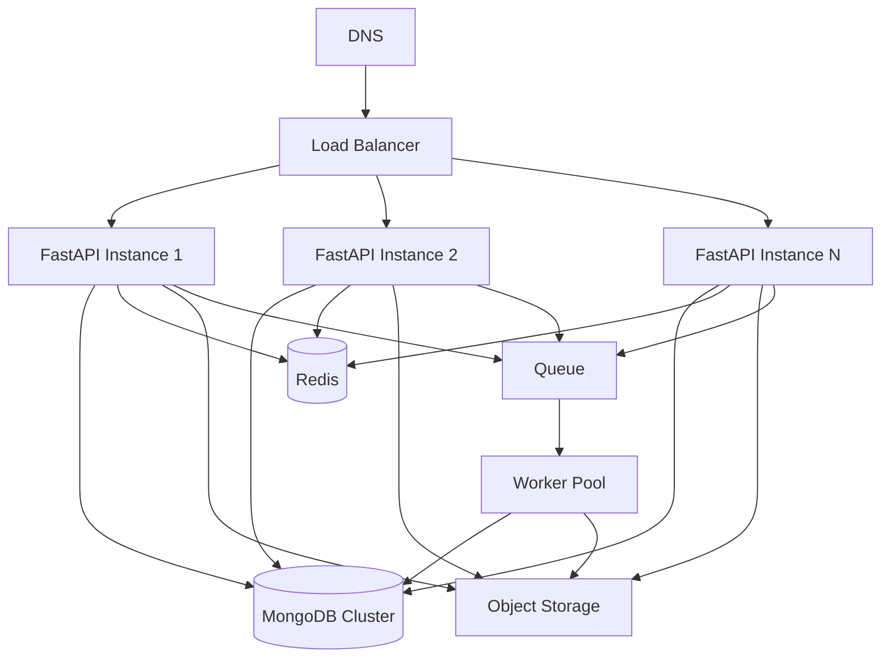

# Scalability Review

## Target Scale

The target platform should support:

- 1,000+ schools
- 2,000+ learners per school
- 2,000,000+ learner records
- Millions of attendance, assessment, finance, and examination records
- Thousands of simultaneous users
- Continuous operation with minimal downtime

## Current Scalability Profile

The FastAPI + MongoDB stack can scale well if deployed as stateless services with proper indexes, caching, background jobs, and object storage. The current implementation is not fully stateless because uploads are stored on the backend filesystem.

## Required Horizontal Architecture

## Scale Blockers

- Local uploads.
- Synchronous bulk report generation.
- Large in-memory reads.
- No distributed cache.
- No queue for long-running work.
- Monolithic backend file limits parallel engineering.
- No explicit API rate limits.
- No visible connection pool tuning or query timeouts.

## Recommended Scaling Improvements

### Stateless Backend

Move all state out of API instances:

- Files to object storage.
- Sessions to JWT/session store.
- Rate limits to Redis.
- Background work to queue.

Impact: Very High.

Effort: Medium.

### Queue-Based Work

Move these operations to workers:

- Bulk CBC report generation.
- Bulk PDF rendering.
- SMS/email delivery.
- Data imports.
- Attendance summary generation.
- Finance statement generation.
- Analytics aggregation.

Impact: Very High.

Effort: High.

### Cache Layer

Cache:

- School branding.
- Role/permission maps.
- Dashboard counters.
- CBC templates.
- Public school code resolution.

Use short TTLs and explicit invalidation after updates.

Impact: High.

Effort: Medium.

### Read Models And Summaries

Create summary collections:

- `dashboard_summaries`
- `attendance_daily_summaries`
- `finance_monthly_summaries`
- `assessment_class_summaries`
- `student_portal_summaries`

Impact: High.

Effort: Medium-High.

## Priority Recommendations

| Recommendation | Priority | Impact | Effort |
|---|---|---:|---:|
| Remove local file dependency | Critical | Very High | Medium |
| Add queue and workers | Critical | Very High | High |
| Add Redis cache and rate limit store | High | High | Medium |
| Add dashboard summary collections | High | High | Medium |
| Add query limits and max page size | Critical | Very High | Low |

## Migration Considerations

- Introduce object storage behind the existing `/uploads` API first.
- Keep existing file URLs working through redirect/proxy during migration.
- Introduce workers for new bulk tasks first, then migrate old synchronous tasks.
- Use feature flags for new summary-based dashboards.
