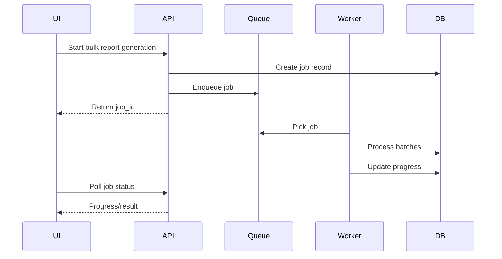

# Performance Review

## Current Performance Risks

Several backend routes fetch large lists into application memory using `to_list(1000)`, `to_list(5000)`, or `to_list(10000)`. This is acceptable for development but risky for a multi-million-record system.

Other risks:

- Repeated queries inside loops.
- Bulk report generation performed synchronously.
- Dashboard counts calculated on demand.
- Super admin routes loading broad platform datasets.
- Client-side PDF generation for complex reports.
- Large frontend bundles growing as modules expand.

## High-Risk Patterns

| Pattern | Risk | Recommendation |
|---|---|---|
| `to_list(10000)` | Memory pressure, slow responses | Pagination and projections |
| Loop with DB query per student | N+1 query cost | Batch fetches and bulk writes |
| Runtime dashboard aggregation | Slow dashboards | Summary collections |
| Local PDF generation in browser | Slow, inconsistent official reports | Server/worker PDF rendering |
| Full document returns | Large payloads | Response DTOs and projections |

## Recommended API Performance Standards

- Default page size: 25 or 50.
- Maximum page size: 100.
- Every list endpoint must support pagination.
- Every list endpoint must support projection or response DTO.
- Every high-volume endpoint must have an index documented.
- All expensive operations must return a job ID.

## Example Pagination Contract

```json
{
  "success": true,
  "data": [],
  "pagination": {
    "page": 1,
    "limit": 50,
    "total": 1832,
    "has_next": true
  }
}
```

## Background Job Pattern



## Frontend Performance

Recommendations:

- Use route-level code splitting.
- Add server-state cache such as TanStack Query.
- Avoid refetching entire datasets after each mutation.
- Use virtualized tables for large lists.
- Move official PDF creation to backend workers.
- Add error boundaries per portal.

## Priority Recommendations

| Recommendation | Priority | Impact | Effort |
|---|---|---:|---:|
| Add pagination to all list endpoints | Critical | Very High | Medium |
| Replace synchronous bulk loops with jobs | Critical | Very High | High |
| Add summary collections for dashboards | High | High | Medium |
| Add projections and response DTOs | High | High | Medium |
| Introduce frontend server-state caching | Medium | Medium | Medium |
