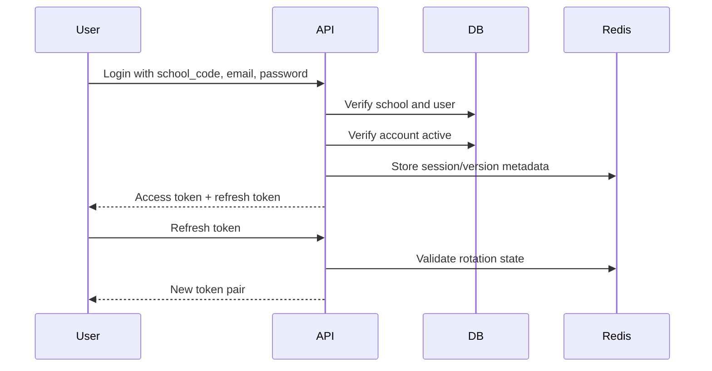

# Authentication Review

## Current Authentication Model

The platform uses JWT access tokens, password hashing, login lockout, school code scoping, and role normalization. Login verifies school code when provided and checks account/school status.

## Strengths

- JWT issuer and token type are checked.
- Password hashing is centralized.
- Account disabled/suspended states are checked.
- School approval/subscription status is checked.
- Login lockout exists.
- School code lookup is part of login flow.

## Gaps

- No refresh token rotation.
- No session list per user/device.
- No token revocation model.
- No forced logout after password reset or deactivation except through DB checks on future requests.
- Tokens are stored in browser local storage in frontend.
- Password reset flow needs stronger staff/admin operational model.

## Recommended Enterprise Auth Model

## Recommendations

### Add Refresh Tokens

- Short-lived access token: 15-30 minutes.
- Refresh token: 7-30 days.
- Rotation on every refresh.
- Reuse detection.
- Device/session metadata.

Impact: High.

Effort: Medium.

### Add Session Revocation

Support:

- Revoke all sessions for user.
- Revoke one device.
- Revoke after password reset.
- Revoke after account deactivation.

Impact: High.

Effort: Medium.

### Token Storage

Current browser `localStorage` strategy is simple but has XSS risk.

Recommended options:

- Secure httpOnly same-site cookies for refresh tokens.
- Keep access tokens in memory where practical.
- If local storage remains, enforce strong CSP and XSS protections.

Impact: High.

Effort: Medium-High.

### Staff Password Reset

Recommended staff flow:

1. Staff uses Forgot Password with school code and email.
2. Request is recorded and shown to school admin.
3. School admin sets a new temporary password.
4. Staff is forced to change password on next login.

Impact: Medium-High.

Effort: Medium.

## Priority Recommendations

| Recommendation | Priority | Impact | Effort |
|---|---|---:|---:|
| Add refresh token rotation | High | High | Medium |
| Add session revocation | High | High | Medium |
| Harden token storage | High | High | Medium |
| Add forced password change | Medium | Medium | Medium |
| Add MFA for admins | Medium | High | Medium |
