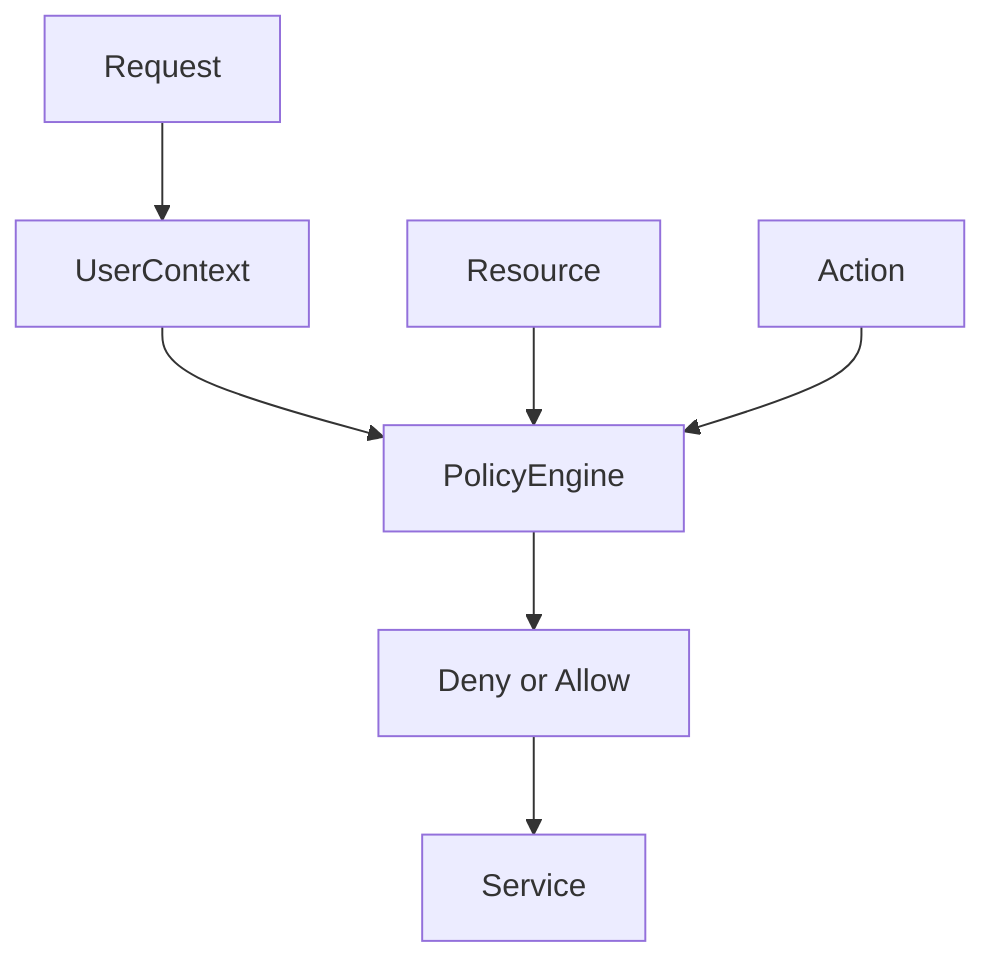

# Authorization Review

## Current Model

Authorization is primarily implemented through role checks inside endpoints. The platform has roles such as:

- `super_admin`
- `school_admin`
- `teacher`
- `finance`
- `secretary`
- `supporting_staff`
- `student`
- `parent`

Recent staff workflows also need detailed designations, but these should not all become system roles. System roles should remain coarse-grained access roles; designations can be staff profile metadata.

## Strengths

- Most endpoints check role.
- Many endpoints enforce `school_id`.
- Super admin bypass patterns exist.
- Login validates school and subscription state.

## Risks

- Authorization is duplicated per endpoint.
- Some roles are normalized in multiple places.
- Fine-grained permissions are not centralized.
- Tests do not yet cover enough cross-tenant and privilege-escalation cases.
- Staff designations such as nurse, librarian, driver, or ICT officer require a clearer permission model.

## Recommended Policy Model

Policy inputs:

- Actor role.
- Actor school.
- Resource school.
- Resource owner.
- Action.
- Module.
- Optional staff designation.

## Example Permission Matrix

| Action | Super Admin | School Admin | Teacher | Finance | Secretary | Student/Parent |
|---|---|---|---|---|---|---|
| View school data | Read all | Own school | Limited own school | Finance scope | Records scope | Own records |
| Create staff | No direct school mutation unless delegated | Yes | No | No | No | No |
| Edit students | Read/support | Yes | Limited | No | Yes | No |
| Enter assessments | Read/support | Yes | Assigned learners/classes | No | No | No |
| Approve reports | Read/support | Yes | No | No | No | No |
| Publish reports | Read/support | Yes | No | No | No | No |
| Manage finance | Read/support | Yes | No | Yes | No | No |

## Recommended Implementation

Create policy functions:

- `require_school_admin(user)`
- `require_same_school(user, resource_school_id)`
- `can_manage_staff(user, target_user)`
- `can_view_student(user, student)`
- `can_edit_assessment(user, report)`
- `can_publish_report(user, report)`
- `can_manage_finance(user)`

Then use them from routes and services.

## Tenant Isolation Tests

Add tests for:

- School admin from school A cannot access school B students.
- Teacher cannot edit unassigned learners.
- Finance cannot access student medical data.
- Parent cannot access another child.
- Student cannot access unpublished report.
- Super admin read-only support access remains controlled and audited.

## Priority Recommendations

| Recommendation | Priority | Impact | Effort |
|---|---|---:|---:|
| Centralize policy enforcement | Critical | Very High | Medium |
| Add cross-tenant tests | Critical | Very High | Medium |
| Separate system roles from staff designations | High | High | Medium |
| Add permission registry | Medium | High | Medium |
| Add admin audit for all privileged actions | High | High | Medium |
