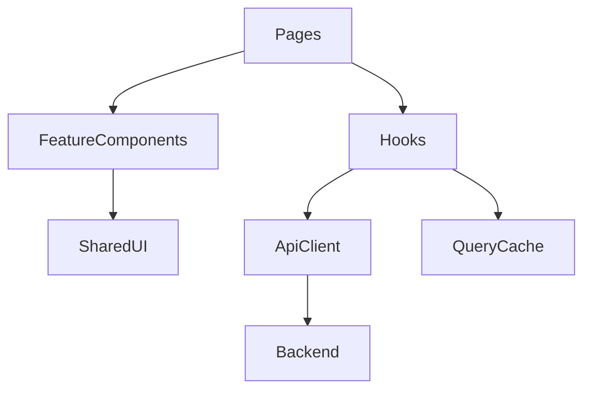

# Frontend Review

## Current Frontend Structure

There are two React frontends:

- Main school-facing frontend under `frontend/src`
- Super admin dashboard under `super-admin-dashboard/src`

The main frontend uses route-based pages and many shared UI components.

## Strengths

- Clear portal routes for school admin, teacher, finance, secretary, student/parent.
- Central API client and auth service exist.
- Component library structure exists under `components/ui`.
- Layout component provides consistent sidebar and school branding.
- Most workflows are implemented with direct, understandable page components.

## Risks

- API state is mostly manually fetched with `useEffect`.
- Many pages duplicate list/loading/error patterns.
- No central cache invalidation strategy.
- No route-level error boundaries.
- Role normalization appears in multiple files.
- Large page components are becoming difficult to maintain.
- Official PDFs are generated in browser in several places, which can be inconsistent.

## Recommended Frontend Architecture



## Recommendations

### Server State Management

Use TanStack Query or similar for:

- Caching.
- Background refetch.
- Mutation invalidation.
- Loading/error consistency.
- Pagination state.

Impact: High.

Effort: Medium.

### Feature Modules

Organize frontend by domain:

```text
src/features/
  students/
  staff/
  finance/
  attendance/
  exams/
  cbc/
  auth/
  support/
```

Impact: Medium-High.

Effort: Medium.

### Access Control

Centralize role normalization and route permissions in one module. Avoid duplicated role maps in pages.

Impact: High.

Effort: Low-Medium.

### UX Consistency

Standardize:

- Empty states.
- Loading skeletons.
- Error states.
- Form validation.
- Confirm dialogs.
- Table pagination.
- Bulk action toolbars.

Impact: Medium.

Effort: Medium.

## Accessibility

Recommendations:

- Ensure dialogs have descriptions.
- Ensure buttons have accessible labels.
- Avoid clickable table rows without keyboard alternatives.
- Add focus management for modals.
- Verify color contrast.
- Add form error text connected to fields.

## Performance

Recommendations:

- Lazy-load route pages.
- Use table virtualization for large datasets.
- Avoid storing huge lists in component state.
- Prefer paginated backend calls.
- Move official report generation to backend.

## Priority Recommendations

| Recommendation | Priority | Impact | Effort |
|---|---|---:|---:|
| Add server-state cache | High | High | Medium |
| Centralize role/route permissions | High | High | Low |
| Add shared paginated table component | High | High | Medium |
| Add error boundaries | Medium | Medium | Low |
| Split large pages into feature components | Medium | Medium | Medium |
