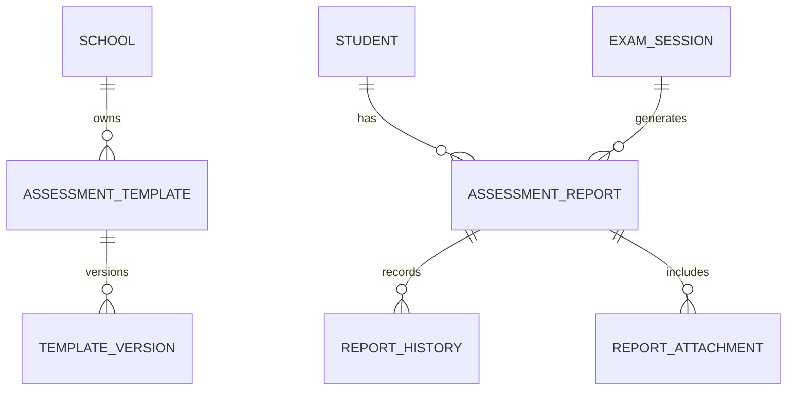

# CBC Module Review

## Current State

The CBC module now includes assessment templates, assessment reports, learning areas, competencies, values, attendance, co-curricular fields, teacher/principal remarks, report workflow statuses, and automatic generation hooks.

## Strengths

- Database-driven template direction is correct.
- Reports preserve historical records.
- Workflow statuses support draft, submitted, approved, published, archived.
- Bulk generation and publishing concepts exist.
- Student/parent portal integration exists for published reports.

## Risks

- CBC curriculum changes need explicit template versioning.
- Report immutability after publication should be strictly enforced.
- Bulk generation should move to background workers.
- Official PDF generation should be server-side.
- Teacher assignment rules need stronger enforcement.
- Senior school pathways need more detailed domain modeling.

## Recommended CBC Domain Model

## Template Versioning

Add:

- `template_version`
- `effective_from`
- `effective_to`
- `approved_by`
- `published_at`
- `curriculum_authority`
- `is_default`

Reports should store a snapshot of the template used, not only a reference.

Impact: High.

Effort: Medium.

## Workflow Improvements

Required states:

- Draft: teacher editable.
- Submitted: teacher read-only.
- Approved: admin-approved.
- Published: visible to parent/student.
- Archived: immutable.
- Rejected/Returned: explicit return to draft with reason.

Add:

- `locked_at`
- `locked_by`
- `published_checksum`
- `pdf_url`
- `verification_qr_payload`

## Senior School Pathways

Model:

- Pathway.
- Track.
- Optional subjects.
- Core subjects.
- School-specific subject offerings.
- Learner subject selection.

Do not hardcode all pathway subjects in code long term.

## Priority Recommendations

| Recommendation | Priority | Impact | Effort |
|---|---|---:|---:|
| Add template versioning | High | High | Medium |
| Move bulk report generation to workers | Critical | Very High | High |
| Add immutable published snapshots | High | High | Medium |
| Add QR verification endpoint | Medium | High | Medium |
| Add stronger teacher-assignment checks | High | High | Medium |
