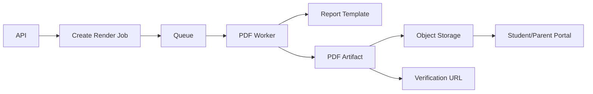

# Reporting Review

## Current State

Reports are generated in a mix of frontend PDF generation and backend report data endpoints. CBC reports include professional report fields but official PDF rendering is not yet a scalable server-side reporting service.

## Strengths

- Report data model includes school and learner details.
- CBC reports include workflow and history concepts.
- Student/parent portal can access published reports.
- Frontend can generate basic PDFs for immediate use.

## Risks

- Browser-generated PDFs are inconsistent across devices.
- Bulk PDF generation can block browsers and APIs.
- No permanent official PDF artifact strategy.
- QR verification and digital signature support are not fully implemented.
- Report layout changes require frontend code changes.

## Recommended Reporting Architecture

## Template Engine

Recommended stack options:

- HTML + CSS templates rendered by Playwright/Chromium.
- Jinja2 templates with strict data contracts.
- Stored template metadata in MongoDB.
- Versioned templates per report type.

Report types:

- CBC report card.
- Fee statement.
- Receipt.
- Attendance summary.
- Exam transcript.
- Staff profile.
- Student profile.
- School compliance report.

## Digital Verification

Add:

- QR code with signed verification URL.
- Verification endpoint.
- Report checksum.
- Published artifact ID.
- Digital signature metadata.

## Bulk Reporting

Bulk jobs should:

- Process in batches.
- Track progress.
- Resume after failure.
- Write per-student success/failure.
- Notify admin when complete.

## Priority Recommendations

| Recommendation | Priority | Impact | Effort |
|---|---|---:|---:|
| Build server-side PDF service | High | High | High |
| Add report artifact storage | High | High | Medium |
| Add QR verification | Medium | High | Medium |
| Add bulk job tracking | High | High | Medium |
| Add template versioning | High | High | Medium |
