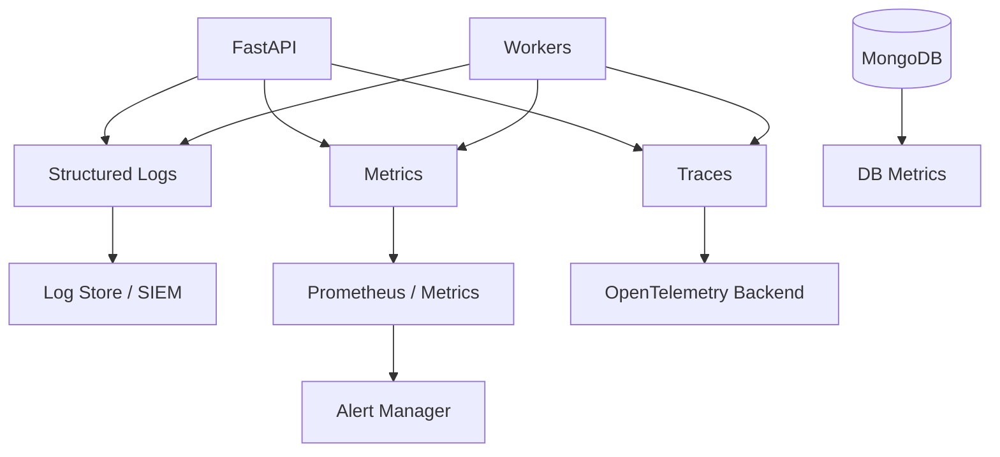

# Monitoring, Logging, And Observability

## Current State

The platform has application logging and audit logs in MongoDB. Some super admin diagnostics exist. Production-grade observability is not yet complete.

## Required Observability Stack

## Logging Recommendations

Use structured JSON logs with:

- `timestamp`
- `level`
- `request_id`
- `trace_id`
- `user_id`
- `school_id`
- `role`
- `route`
- `method`
- `status_code`
- `duration_ms`
- `error_code`

Do not log:

- Passwords.
- Tokens.
- Reset codes.
- Full payment secrets.
- Sensitive medical data.

## Metrics

Track:

- Request count by route/status.
- Latency p50/p95/p99.
- Error rate.
- DB query duration.
- Login success/failure.
- Upload count/size.
- Queue depth.
- Worker success/failure.
- PDF generation time.
- Notification delivery success/failure.

## Alerts

Recommended alerts:

- API error rate above threshold.
- Login failure spike.
- MongoDB CPU/memory/storage high.
- Queue backlog growing.
- Worker failure rate high.
- Disk usage high.
- Upload failures.
- Payment callback failures.
- Slow endpoint p95 over threshold.

## Health Checks

Expose:

- `/health/live`: process alive.
- `/health/ready`: DB/cache/object storage reachable.
- `/health/dependencies`: detailed internal dependency status for admin only.

## Priority Recommendations

| Recommendation | Priority | Impact | Effort |
|---|---|---:|---:|
| Add structured request logs | High | High | Medium |
| Add OpenTelemetry tracing | Medium | High | Medium |
| Add metrics and dashboards | High | High | Medium |
| Add health/readiness endpoints | High | High | Low |
| Add production alerting | High | High | Medium |
