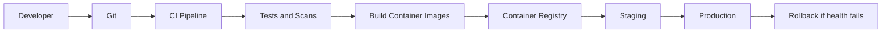

# Deployment Review

## Current Deployment Readiness

The codebase can run locally and build frontend artifacts. For enterprise production, deployment should be standardized through containers, CI/CD, environment separation, and managed infrastructure.

## Recommended Deployment Architecture

## Containerization

Recommended services:

- `api`: FastAPI app.
- `worker`: background job processor.
- `frontend`: static build or CDN artifact.
- `super-admin`: static build or CDN artifact.

Do not run MongoDB inside the application container for production.

## Environment Separation

Required environments:

- Local development.
- CI test.
- Staging.
- Production.

Each environment must have separate:

- Database.
- Object storage bucket.
- Redis.
- Secrets.
- Payment/SMS/email credentials.

## CI/CD Pipeline

Minimum checks:

- Backend compile.
- Backend tests.
- Frontend build.
- Super admin build.
- Lint.
- Dependency vulnerability scan.
- Docker build.
- Migration dry-run.

## Release Strategy

Recommended:

- Rolling deployments for minor changes.
- Blue/green for major releases.
- Feature flags for risky modules.
- Automated rollback if readiness checks fail.

## Secrets Management

Use:

- Cloud secret manager.
- Kubernetes secrets with external secret sync.
- Environment variables injected at runtime.

Never commit:

- JWT secret.
- Mongo URL.
- SMS credentials.
- Payment credentials.
- Object storage secret keys.

## Backup And Disaster Recovery

Production requirements:

- Automated MongoDB backups.
- Point-in-time recovery.
- Object storage versioning.
- Restore drills.
- Disaster recovery runbook.

## Priority Recommendations

| Recommendation | Priority | Impact | Effort |
|---|---|---:|---:|
| Containerize API and workers | High | High | Medium |
| Add CI/CD pipeline | High | High | Medium |
| Add staging environment | High | High | Medium |
| Add secrets manager | High | High | Medium |
| Add rollback strategy | High | High | Medium |
