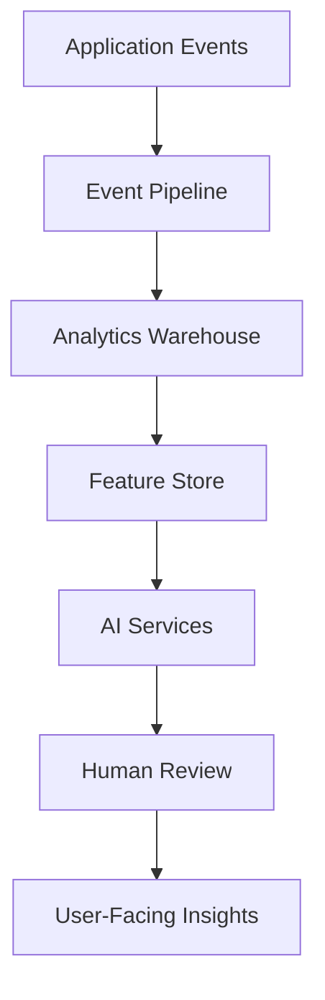

# Future Features And Expansion Readiness

## Future Module Targets

The platform should be designed to support:

- Transport
- Hostel management
- Library
- Clinic
- Payroll
- HR
- Procurement
- Procurement approvals
- Alumni
- LMS
- Online examinations
- E-learning
- Video lessons
- Assignments
- Marketplace
- Government integrations
- Payment gateways
- Third-party APIs

## Recommended Expansion Pattern

Each module should define:

- Data ownership.
- Roles and permissions.
- School scoping rules.
- Audit events.
- Notification events.
- API routes.
- Background jobs.
- Reporting needs.
- Mobile API needs.

## AI Readiness

Future AI use cases:

- Academic analytics.
- Predictive learner performance.
- Attendance trends.
- Fee payment prediction.
- Automated report comments.
- Timetable optimization.
- Natural language search.
- Administrative assistant.

## AI Data Foundation

Before adding AI, build:

- Clean event logs.
- Stable learner timeline.
- Attendance summaries.
- Assessment summaries.
- Finance summaries.
- Data dictionary.
- Consent and privacy policy.
- Feature store or analytics warehouse.

## Mobile Readiness

Mobile apps need:

- Versioned APIs.
- Stable DTOs.
- Pagination.
- Offline-friendly sync endpoints.
- Push notification tokens.
- Smaller payloads.
- Media upload with resumable support.

## Integration Readiness

For third-party integrations:

- API keys per school/integration.
- OAuth where appropriate.
- Webhook delivery with retries.
- Signed webhook payloads.
- Integration audit logs.
- Rate limits per integration.

## Priority Recommendations

| Recommendation | Priority | Impact | Effort |
|---|---|---:|---:|
| Create module template/guidelines | Medium | High | Medium |
| Add event logging foundation | High | High | Medium |
| Add mobile API standards | Medium | High | Medium |
| Add webhook framework | Medium | Medium | Medium |
| Add analytics warehouse plan | Medium | High | High |
