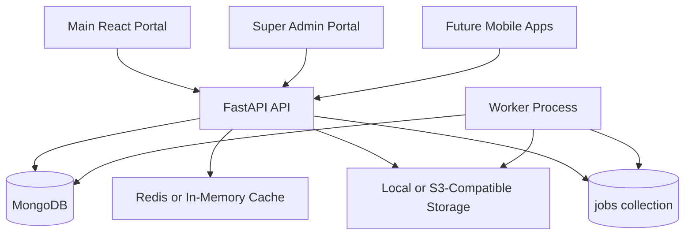

# Updated Architecture Documentation

## Current Runtime Architecture

## Backend Organization

- `backend/server.py` still preserves existing handlers and public route behavior.
- `backend/app/core` contains shared response, serialization, settings, role, and router-extraction utilities.
- `backend/app/staff`, `backend/app/students`, `backend/app/finance`, and `backend/app/cbc` now host extracted domain routers.
- `backend/services` contains reusable operational services for cache, storage, dashboard summaries, jobs, notifications, events, webhooks, and report artifacts.

## Compatibility Strategy

Existing routes remain available under `/api`. The `/api/v1` alias middleware and OpenAPI duplication remain available for newer clients.

Domain route extraction is compatibility-safe: existing route objects are moved into domain routers without changing endpoint functions, dependencies, paths, or response bodies.

## Operational Architecture

- API and worker can scale independently.
- Frontends can be hosted as static CDN artifacts.
- Background work is queued in MongoDB-backed job collections.
- Health and readiness endpoints support load balancer and deployment gates.
