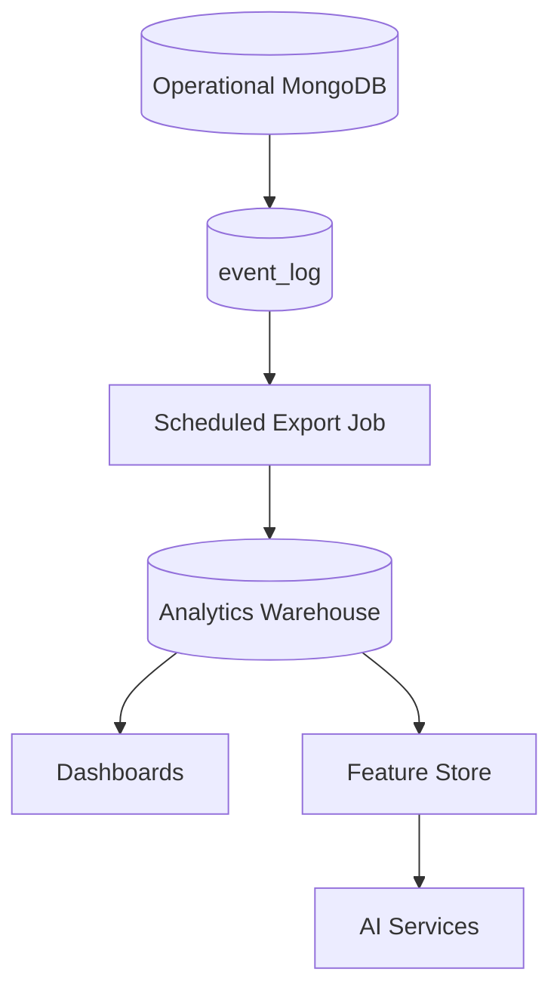

# Analytics And AI Readiness

## Event Foundation

The `event_log` collection captures product events for future learner timelines, analytics exports, and AI features.

Initial event fields:

- `event_type`
- `school_id`
- `actor_id`
- `entity_type`
- `entity_id`
- `payload`
- `created_at`

## Warehouse Plan

Operational MongoDB should not become the analytics warehouse. Export append-only events and approved analytical snapshots to a separate warehouse.

## Human Review

AI-generated report comments, fee predictions, attendance risk flags, and timetable recommendations must remain advisory until reviewed by authorized school staff.
