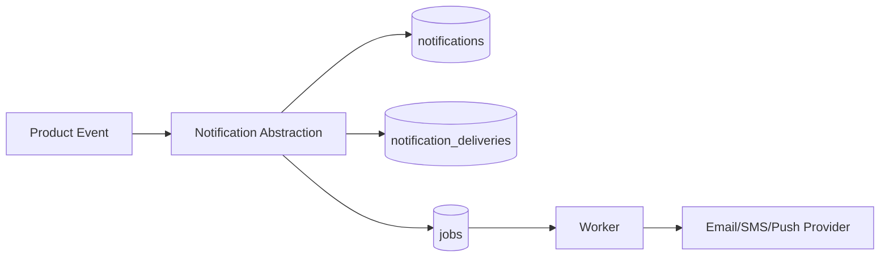

# Notification Architecture

## Channels

The notification foundation supports:

- In-app notifications.
- Email.
- SMS.
- Push notifications.

Current production behavior remains in-app first. Additional providers should be attached through queued `notification_delivery` jobs.

## Flow

## Delivery Rules

- Never block a user workflow on external provider delivery.
- Store delivery attempts separately from notification records.
- Retry transient failures with backoff.
- Keep in-app records available even when external providers fail.
