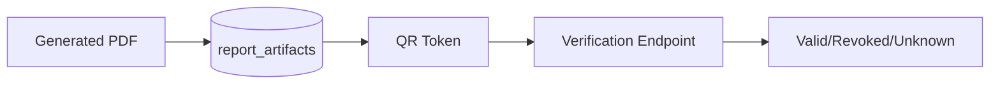

# Report Artifacts

## Artifact Model

Official report rendering should store immutable artifact manifests in `report_artifacts`.

Fields include:

- `report_id`
- `student_id`
- `exam_id`
- `artifact_type`
- `status`
- `checksum`
- `qr_verification_token`
- `digital_signature`
- `immutable`

## Verification Flow

## Rule

Published report artifacts should be append-only. If a correction is required, create a new artifact version and keep the old artifact archived.

## Current Backend Endpoint

`GET /api/assessments/reports/{report_id}/pdf-official` provides a server-rendered PDF without replacing the legacy `/pdf` metadata endpoint.
