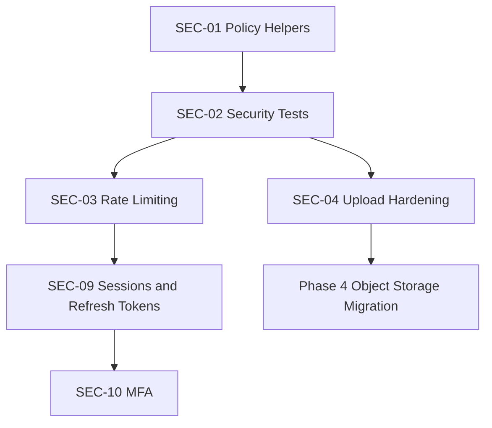

# Phase 1 - Critical Security

Goal: strengthen tenant isolation, authorization, upload safety, token/session safety, and high-risk public endpoints without redesigning working authentication flows.

## Compatibility Requirements

- Preserve existing login, role names, and school isolation behavior.
- Preserve current frontend routes and API paths.
- Add new security layers incrementally.
- Do not break student/parent registration or staff admin-created login.

## Recommendations

| ID | Recommendation | Priority | Reason | Expected Benefit | Effort | Risk | Dependencies | DB Migration | Frontend Changes | Backend Changes | Downtime |
|---|---|---|---|---|---|---|---|---|---|---|---|
| SEC-01 | Centralize tenant isolation and authorization policy helpers | Critical | Role and school checks are duplicated across endpoints | Reduces cross-school leakage and privilege bypass risk | Medium | Medium | Existing `get_current_user`, role normalization | No | No | Yes | No |
| SEC-02 | Add cross-tenant and privilege-escalation tests | Critical | Security correctness must be provable before scale | Prevents regressions in school isolation | Medium | Low | SEC-01 policy helpers preferred | No | No | Yes | No |
| SEC-03 | Add rate limiting for login, forgot password, join school, school resolve, uploads, support tickets, and bulk actions | High | Public and expensive endpoints are abuse targets | Reduces brute force, scraping, and resource exhaustion | Medium | Medium | Redis recommended; temporary DB-backed limiter possible | Optional | No | Yes | No |
| SEC-04 | Harden upload security with metadata records, magic-byte checks, private file policy, and audit access | Critical | Local direct uploads can expose sensitive documents | Safer file handling and future object-storage migration | Medium | Medium | Existing upload API | Yes, add `file_assets` metadata collection | Minimal, preserve upload helper | Yes | No |
| SEC-05 | Add security headers and production CSP | High | Browser-facing app needs baseline XSS/clickjacking protection | Reduces XSS and framing risk | Low | Medium | Frontend asset host/domain inventory | Possible config only | Possible if inline scripts/styles conflict | Yes | No |
| SEC-06 | Redact sensitive data in logs and responses | High | PII, password reset data, tokens, and hashes must never leak | Safer support and audit operations | Medium | Medium | Standard response DTOs later help | No | No | Yes | No |
| SEC-07 | Add dependency vulnerability scanning and SBOM generation | High | Security issues in dependencies must be detected early | Reduces supply-chain risk | Low | Low | CI pipeline preferred | No | No | No app logic; DevOps scripts | No |
| SEC-08 | Add admin-mediated staff password reset request flow | Medium | Staff reset should remain school-admin controlled | Secure staff recovery workflow | Medium | Medium | Staff management already admin-owned | Yes, reset request records | Yes | Yes | No |
| SEC-09 | Add refresh token/session revocation design in compatibility mode | High | Current access-token-only approach limits revocation and session control | Better enterprise session management | Medium | High | Token storage policy, Redis/session store | Yes, sessions collection or Redis | Yes, later rollout | Yes | No if staged |
| SEC-10 | Add MFA option for school admins and super admins | Medium | Admin compromise has high impact | Stronger privileged account security | Medium | Medium | Session model preferred | Yes | Yes | Yes | No |

## Recommended Sequence

## Migration Notes

- `SEC-01` should start as helper functions used by the most sensitive endpoints first: students, staff, finance, CBC reports, uploads, super admin.
- `SEC-04` should store file metadata without changing current upload URLs initially.
- `SEC-09` should keep existing access-token flow working until frontend refresh support is deployed.
- `SEC-10` should be optional/enforced per role after adoption.

## Acceptance Criteria

- Cross-school access tests fail before policy enforcement and pass after.
- Staff, students, parents, and school admins retain current valid workflows.
- Public endpoints have abuse controls.
- Upload metadata is recorded for every new upload.
- No API response returns password hashes, reset codes, or internal tokens.
