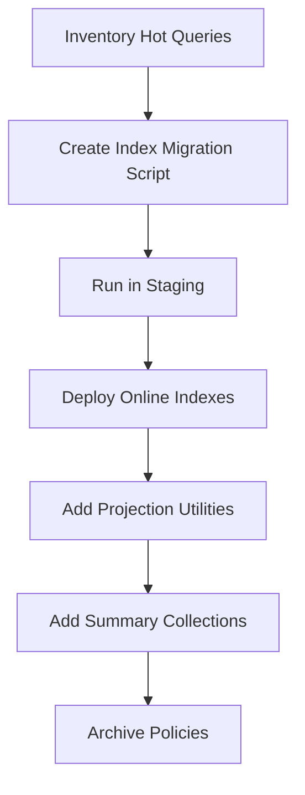

# Phase 2 - Database Optimization

Goal: make MongoDB access safe for millions of records through indexes, query shape controls, migrations, archival planning, and backup readiness.

## Compatibility Requirements

- Preserve existing UUID string `id` fields.
- Preserve Mongo `_id` compatibility where currently used.
- Preserve all historical academic, financial, attendance, and report records.
- Avoid destructive migrations.

## Recommendations

| ID | Recommendation | Priority | Reason | Expected Benefit | Effort | Risk | Dependencies | DB Migration | Frontend Changes | Backend Changes | Downtime |
|---|---|---|---|---|---|---|---|---|---|---|---|
| DB-01 | Add compound indexes aligned to hot queries | Critical | Large collections need indexed school, status, class, date, and student lookups | Faster queries at scale | Medium | Medium | Query inventory | Yes, index migration | No | Yes | No if online indexes |
| DB-02 | Add production index migration scripts instead of relying only on startup index creation | High | Startup index creation can slow production boot and hide migration failures | Safer controlled deploys | Medium | Low | DB-01 | Yes | No | Yes/scripts | No |
| DB-03 | Add pagination-ready query utilities with projections | Critical | Large reads currently risk memory pressure | Lower latency and memory use | Medium | Medium | API pagination standards | No | Later for pagination UI | Yes | No |
| DB-04 | Add archival policy for attendance, notifications, audit logs, support logs, generated report artifacts | High | High-volume operational data will grow quickly | Keeps live collections fast while preserving history | Medium | Medium | Object storage for cold artifacts preferred | Yes | No | Yes | No |
| DB-05 | Create dashboard and module summary collections | High | Dashboards should not scan raw records repeatedly | Faster dashboards | Medium-High | Medium | Queue/worker improves updates | Yes | Possible | Yes | No |
| DB-06 | Add backup and restore runbook with point-in-time recovery targets | High | Enterprise production needs verified recovery | Reduces data-loss risk | Medium | Low | Managed MongoDB or backup tooling | No app migration | No | No app logic | No |
| DB-07 | Add TTL indexes only for temporary data | Medium | Login attempts, reset codes, and ephemeral jobs need cleanup | Keeps temporary collections small | Low | Low | Identify temp collections | Yes | No | Yes | No |
| DB-08 | Add data dictionary for high-value collections | Medium | Future modules, analytics, and AI need consistent semantics | Improves maintainability and reporting | Medium | Low | Stable schemas | No | No | Documentation/scripts | No |

## Initial Index Set

| Collection | Index |
|---|---|
| `students` | `{school_id: 1, class_name: 1, status: 1, approval_status: 1}` |
| `students` | `{school_id: 1, admission_number: 1}` |
| `users` | `{school_id: 1, email: 1}` |
| `users` | `{school_id: 1, role: 1, status: 1}` |
| `attendance` | `{school_id: 1, date: -1, class_name: 1}` |
| `attendance` | `{school_id: 1, student_id: 1, date: -1}` |
| `payments` | `{school_id: 1, student_id: 1, created_at: -1}` |
| `payments` | `{school_id: 1, approval_status: 1, status: 1, created_at: -1}` |
| `finance_transactions` | `{school_id: 1, approval_status: 1, date: -1}` |
| `results` | `{school_id: 1, exam_id: 1, student_id: 1}` |
| `assessment_reports` | `{school_id: 1, student_id: 1, status: 1, created_at: -1}` |
| `assessment_reports` | `{school_id: 1, exam_id: 1, class_name: 1, status: 1}` |
| `audit_logs` | `{school_id: 1, timestamp: -1}` |
| `notifications` | `{school_id: 1, recipient_id: 1, read: 1, created_at: -1}` |

## Recommended Sequence

## Migration Notes

- Use sparse/partial indexes carefully where legacy records may lack fields.
- Avoid unique index creation until duplicate cleanup is complete.
- Run index builds during low traffic for self-hosted MongoDB.
- Keep old raw collections as source of truth while adding summary collections.

## Acceptance Criteria

- Hot list queries use indexed predicates.
- No large list endpoint is blocked waiting for unindexed scans.
- Backup/restore process is documented and tested.
- Temporary collections have retention rules.
