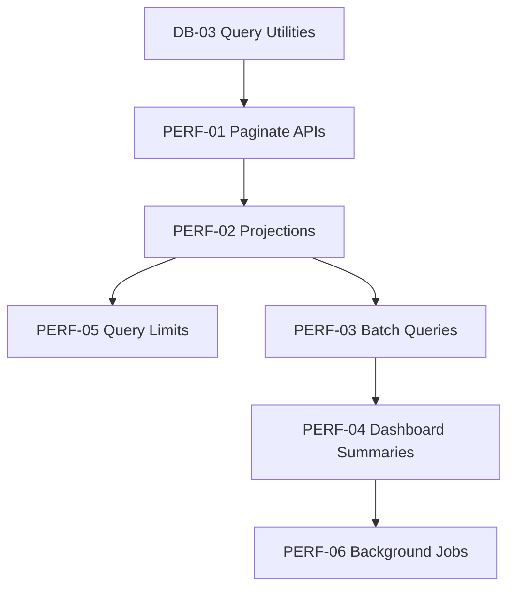

# Phase 3 - Performance Optimization

Goal: reduce response time, memory pressure, repeated queries, and heavy synchronous work while preserving current behavior.

## Recommendations

| ID | Recommendation | Priority | Reason | Expected Benefit | Effort | Risk | Dependencies | DB Migration | Frontend Changes | Backend Changes | Downtime |
|---|---|---|---|---|---|---|---|---|---|---|---|
| PERF-01 | Add pagination to all high-volume list endpoints | Critical | `to_list(1000+)` patterns will not scale | Lower memory use and faster responses | Medium | Medium | DB-03 query utilities | No | Yes for paginated screens | Yes | No |
| PERF-02 | Add response projections and explicit DTOs for large payloads | High | Full documents leak data and increase payload size | Faster APIs and better security | Medium | Medium | API DTO strategy | No | Possible field adjustments | Yes | No |
| PERF-03 | Replace N+1 loops with batch fetches and bulk writes | High | Bulk report and portal operations can be slow | Better throughput | Medium | Medium | DB indexes | No | No | Yes | No |
| PERF-04 | Add dashboard summary read models | High | Dashboards should not compute all counts on demand | Faster dashboards | Medium | Medium | DB-05 | Yes | Possible | Yes | No |
| PERF-05 | Add server-side query timeouts and max result limits | High | Prevents runaway queries | Protects API and DB under load | Low | Medium | Pagination policy | No | No | Yes | No |
| PERF-06 | Move expensive report/PDF work out of request-response path | High | Heavy work can block users and API workers | Better user experience | High | Medium | Queue foundation in Phase 4 | Yes for jobs | Yes for job progress | Yes | No |
| PERF-07 | Add frontend route-level code splitting | Medium | Frontend bundle will grow as modules expand | Faster initial load | Medium | Low | Stable routing | No | Yes | No | No |
| PERF-08 | Add table virtualization for large admin tables | Medium | Large DOM tables become slow | Faster frontend lists | Medium | Low | Paginated APIs preferred | No | Yes | No | No |

## API Pagination Standard

```json
{
  "success": true,
  "data": [],
  "pagination": {
    "page": 1,
    "limit": 50,
    "total": 0,
    "has_next": false
  }
}
```

## Recommended Sequence



## Compatibility Notes

- Keep existing list endpoints but add optional `page`, `limit`, and filters.
- For frontend compatibility, initial backend responses can include both `data` and legacy aliases where necessary.
- Use default page sizes that preserve current user workflows.

## Acceptance Criteria

- No user-facing list endpoint returns unbounded results.
- Large reads have max limits.
- Dashboard response time remains stable as data grows.
- Batch operations do not block request workers for long-running jobs.
