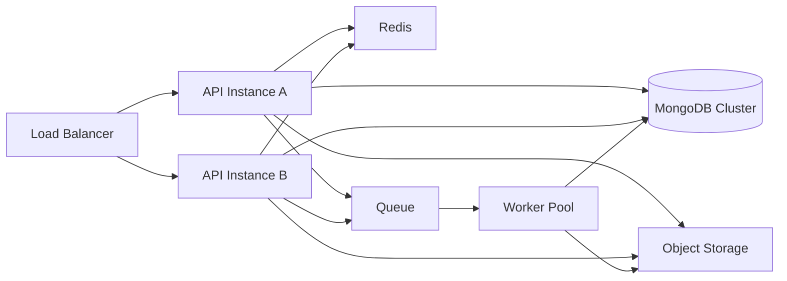

# Phase 4 - Scalability Improvements

Goal: make Smart M Hub horizontally scalable through stateless API instances, object storage, Redis, queues, workers, and summary processing.

## Recommendations

| ID | Recommendation | Priority | Reason | Expected Benefit | Effort | Risk | Dependencies | DB Migration | Frontend Changes | Backend Changes | Downtime |
|---|---|---|---|---|---|---|---|---|---|---|---|
| SCALE-01 | Move file storage from local filesystem to S3-compatible object storage | Critical | Local files block multi-instance deployment | Horizontal API scaling and safer file lifecycle | Medium | High | SEC-04 upload metadata | Yes, file metadata/backfill | Minimal if URL compatible | Yes | No if staged |
| SCALE-02 | Add Redis for cache, rate limits, session metadata, and lightweight locks | High | Multi-instance services need shared ephemeral state | Faster reads and distributed controls | Medium | Medium | Deployment environment | Optional | No | Yes | No |
| SCALE-03 | Add queue and worker service | Critical | Bulk work must not block API requests | Scalable reports, imports, notifications | High | Medium | Redis or queue backend | Yes, job records | Yes for job progress | Yes | No |
| SCALE-04 | Move CBC bulk generation to worker jobs | Critical | Synchronous class-wide report generation will not scale | Reliable bulk processing | Medium | Medium | SCALE-03 | Yes | Yes, job status UI | Yes | No |
| SCALE-05 | Move notification delivery to workers | High | Email/SMS/push delivery needs retries | Reliable communication | Medium | Medium | SCALE-03, notification abstraction | Yes | Possible notification UI | Yes | No |
| SCALE-06 | Add cache for school branding, permission maps, CBC templates, dashboard counters, and school-code resolution | High | Repeated reads add load | Lower DB traffic and faster UX | Medium | Medium | SCALE-02 | No | No | Yes | No |
| SCALE-07 | Add connection pool and query timeout configuration | Medium | Production DB load needs tuning | More predictable behavior under load | Low | Medium | Typed settings | No | No | Yes | Restart only |
| SCALE-08 | Add feature flags for high-risk scale features | Medium | Staged rollouts reduce blast radius | Safer deployment | Medium | Low | Config system | Optional | Possible admin UI later | Yes | No |

## Target Scalable Runtime

## Object Storage Migration

1. Add `file_assets` metadata collection.
2. Keep existing `/uploads` API contract.
3. Store new files in object storage.
4. Backfill old local files.
5. Keep old URLs resolving through proxy/redirect.
6. Later migrate consumers to signed URL retrieval.

## Acceptance Criteria

- Two API instances can run simultaneously and serve the same uploaded files.
- Bulk CBC generation returns a job ID and does not block the API.
- Failed notification/report jobs can be retried.
- Cached school branding updates after school profile changes.
