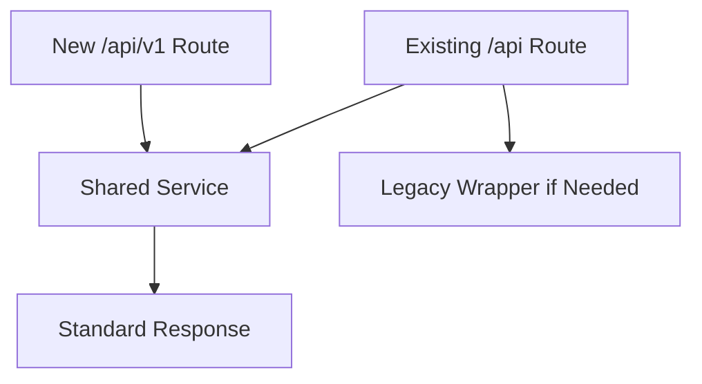

# Phase 5 - API Improvements

Goal: standardize the API for web, mobile, and third-party clients while preserving current routes and payload compatibility.

## Recommendations

| ID | Recommendation | Priority | Reason | Expected Benefit | Effort | Risk | Dependencies | DB Migration | Frontend Changes | Backend Changes | Downtime |
|---|---|---|---|---|---|---|---|---|---|---|---|
| API-01 | Introduce `/api/v1` routes as aliases for existing endpoints | High | Mobile and integrations need stable versioning | Future-safe API evolution | Medium | Medium | Route organization | No | No initially | Yes | No |
| API-02 | Standardize response envelopes | High | Current responses vary across endpoints | Easier frontend/mobile handling | Medium | Medium | Compatibility wrappers | No | Gradual | Yes | No |
| API-03 | Standardize error envelopes and error codes | High | Errors are inconsistent and hard to automate | Better UX and support diagnostics | Medium | Medium | Request ID logging | No | Gradual | Yes | No |
| API-04 | Replace raw `dict` request bodies with Pydantic schemas | Medium | Raw dicts reduce validation and OpenAPI quality | Safer APIs and documentation | Medium | Low-Medium | Domain schemas | No | No if fields preserved | Yes | No |
| API-05 | Add OpenAPI tags, operation IDs, and examples | Medium | Better documentation for mobile/partners | Easier integration | Low-Medium | Low | API schemas | No | No | Yes | No |
| API-06 | Add backward-compatible deprecation policy | Medium | Route evolution must not break existing users | Safer long-term changes | Low | Low | Versioning | No | No | Documentation/backend headers | No |
| API-07 | Move mutation parameters from query string into request bodies where appropriate | Medium | Important mutations should be explicit and typed | Cleaner API contracts | Medium | Medium | API versioning | No | Yes for new endpoints | Yes | No |

## Standard Response

```json
{
  "success": true,
  "data": {},
  "message": "Optional message",
  "pagination": null,
  "request_id": "req_..."
}
```

## Standard Error

```json
{
  "success": false,
  "error": {
    "code": "permission_denied",
    "message": "You do not have permission to perform this action",
    "details": {}
  },
  "request_id": "req_..."
}
```

## Compatibility Strategy



## Acceptance Criteria

- Existing frontend continues to work.
- New `/api/v1` route group exists.
- OpenAPI groups routes by domain.
- At least the top-volume modules use typed request schemas.
