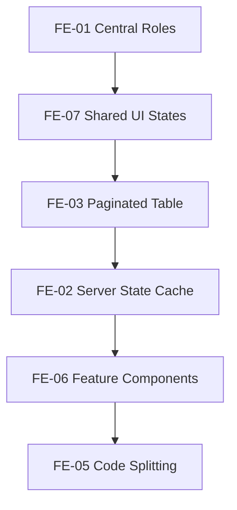

# Phase 6 - Frontend Improvements

Goal: improve frontend maintainability, speed, consistency, accessibility, and future mobile/API compatibility without changing business workflows.

## Recommendations

| ID | Recommendation | Priority | Reason | Expected Benefit | Effort | Risk | Dependencies | DB Migration | Frontend Changes | Backend Changes | Downtime |
|---|---|---|---|---|---|---|---|---|---|---|---|
| FE-01 | Centralize role normalization and route permissions | High | Role maps are duplicated | Fewer access bugs and easier changes | Low-Medium | Low | Current auth service | No | Yes | No | No |
| FE-02 | Add server-state cache such as TanStack Query | High | Manual `useEffect` fetching is duplicated | Better caching, retries, invalidation | Medium | Medium | Stable API responses preferred | No | Yes | No | No |
| FE-03 | Add shared paginated table component | High | Many modules need consistent pagination/search/actions | Faster implementation and better UX | Medium | Medium | Backend pagination | No | Yes | No | No |
| FE-04 | Add route-level error boundaries | Medium | Runtime page errors should not crash whole app | Better resilience | Low | Low | React route structure | No | Yes | No | No |
| FE-05 | Add route-level code splitting | Medium | Bundle grows as modules expand | Faster initial load | Medium | Low | Stable routes | No | Yes | No | No |
| FE-06 | Split large pages into feature components | Medium | Large page files are harder to maintain | Better maintainability | Medium | Medium | No API dependency | No | Yes | No | No |
| FE-07 | Standardize loading, empty, error, confirm, and form validation patterns | Medium | UX is inconsistent across modules | More professional user experience | Medium | Low | Shared components | No | Yes | No | No |
| FE-08 | Improve accessibility for dialogs, buttons, table rows, focus management, and contrast | Medium | Enterprise apps need accessible workflows | Better usability and compliance | Medium | Low | Component audit | No | Yes | No | No |
| FE-09 | Move official report/PDF actions to backend job flow once available | Medium | Browser PDFs are inconsistent | Reliable official documents | Medium | Medium | Reporting worker | No | Yes | Yes | No |

## Target Frontend Structure

```text
src/
  features/
    auth/
    staff/
    students/
    finance/
    attendance/
    exams/
    cbc/
    support/
  components/
    ui/
    data/
    forms/
  services/
  hooks/
```

## Recommended Sequence



## Acceptance Criteria

- Role normalization exists in one frontend source of truth.
- At least staff/students/finance lists use shared pagination patterns once backend supports them.
- Pages show consistent loading/error/empty states.
- Critical dialogs are keyboard and screen-reader friendly.
