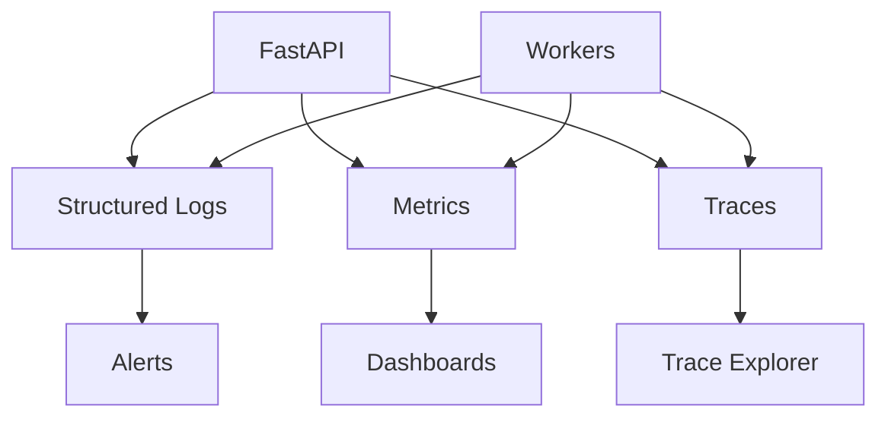

# Phase 7 - Monitoring And Logging

Goal: make Smart M Hub observable in production with structured logs, metrics, tracing, health checks, and actionable alerts.

## Recommendations

| ID | Recommendation | Priority | Reason | Expected Benefit | Effort | Risk | Dependencies | DB Migration | Frontend Changes | Backend Changes | Downtime |
|---|---|---|---|---|---|---|---|---|---|---|---|
| OBS-01 | Add request IDs and structured JSON request logs | High | Support and debugging need correlation | Faster incident diagnosis | Medium | Low | Logging config | No | No | Yes | Restart only |
| OBS-02 | Add structured audit taxonomy for privileged actions | High | Audit logs exist but need consistency | Better compliance and investigations | Medium | Medium | Policy helpers | Possible field normalization | No | Yes | No |
| OBS-03 | Add metrics for request count, latency, errors, logins, uploads, queue depth, workers, PDFs, notifications | High | Operators need real-time platform health | Faster detection of production issues | Medium | Low | Metrics backend | No | No | Yes | Restart only |
| OBS-04 | Add health and readiness endpoints | High | Load balancers and deployments need health signals | Safer deployments | Low | Low | DB/cache/object storage checks | No | No | Yes | No |
| OBS-05 | Add OpenTelemetry tracing | Medium | Cross-service debugging will be needed with workers | Better distributed diagnostics | Medium | Medium | Worker/queue architecture preferred | No | No | Yes | Restart only |
| OBS-06 | Add alert rules for error spikes, login failures, DB pressure, queue backlog, upload failures, payment callback failures | High | Production incidents need proactive alerting | Reduced downtime | Medium | Low | Metrics/logs | No | No | DevOps config | No |
| OBS-07 | Add frontend error capture | Medium | Browser issues need visibility | Faster UI bug diagnosis | Medium | Low | Error boundary | No | Yes | Optional backend endpoint | No |

## Structured Log Fields

- `timestamp`
- `level`
- `request_id`
- `trace_id`
- `user_id`
- `school_id`
- `role`
- `route`
- `method`
- `status_code`
- `duration_ms`
- `error_code`

## Observability Flow

## Acceptance Criteria

- Every API response includes or logs a request ID.
- Readiness endpoint fails when MongoDB or critical dependencies are unavailable.
- Error-rate and latency dashboards exist.
- Login failure spikes and queue backlog can trigger alerts.
