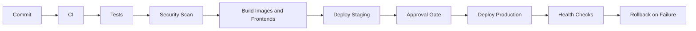

# Phase 8 - Deployment And DevOps

Goal: create repeatable, safe, production-grade deployment and operational processes.

## Recommendations

| ID | Recommendation | Priority | Reason | Expected Benefit | Effort | Risk | Dependencies | DB Migration | Frontend Changes | Backend Changes | Downtime |
|---|---|---|---|---|---|---|---|---|---|---|---|
| DEVOPS-01 | Containerize API and worker services | High | Production needs consistent runtime artifacts | Safer deployments and scaling | Medium | Medium | Worker design for worker image | No | No | Config/startup changes | No |
| DEVOPS-02 | Host frontends as static CDN artifacts | High | Frontends should scale independently | Lower latency and simpler web scaling | Medium | Low | Build pipeline | No | Build config | No | No |
| DEVOPS-03 | Add CI/CD pipeline with backend compile, tests, frontend builds, lint, dependency scan, Docker build, migration dry-run | High | Manual deploys are risky | Safer releases | Medium | Medium | Test commands stable | No | No | No app logic | No |
| DEVOPS-04 | Add staging environment mirroring production dependencies | High | Risky changes need realistic validation | Fewer production regressions | Medium | Low | Environment config | No | No | Config only | No |
| DEVOPS-05 | Add secrets manager integration | High | Secrets should not live in code or local files | Better secret safety | Medium | Medium | Deployment target | No | No | Config changes | Restart only |
| DEVOPS-06 | Add rollback strategy with health-gated deployments | High | Bad deploys need fast recovery | Lower downtime risk | Medium | Medium | Health endpoints | No | No | Deployment config | No |
| DEVOPS-07 | Add automated backup, PITR, object-storage versioning, and restore drills | High | Data recovery is required for enterprise SaaS | Reduced data loss risk | Medium | Low | Managed DB/storage | No app migration | No | No app logic | No |
| DEVOPS-08 | Add environment-specific configuration validation | Medium | Misconfiguration causes outages | Safer startup | Low-Medium | Low | Typed settings | No | No | Yes | Restart only |

## CI/CD Flow

## Acceptance Criteria

- A clean checkout can build API, frontend, and super-admin artifacts through CI.
- Production secrets are not stored in repository files.
- Staging uses separate DB/storage/cache.
- Rollback procedure is documented and tested.
