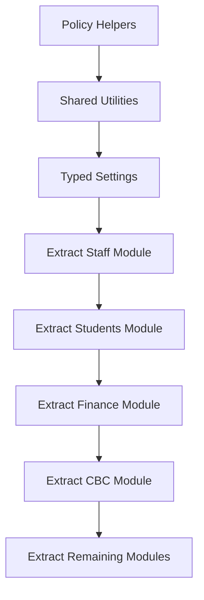

# Phase 9 - Code Cleanup And Refactoring

Goal: improve maintainability by modularizing code after security, database, performance, and observability foundations are in place.

## Recommendations

| ID | Recommendation | Priority | Reason | Expected Benefit | Effort | Risk | Dependencies | DB Migration | Frontend Changes | Backend Changes | Downtime |
|---|---|---|---|---|---|---|---|---|---|---|---|
| REFACTOR-01 | Split `backend/server.py` into domain routers and services | Critical | Single-file backend is hard to audit and maintain | Faster safe development | High | High | Tests, policy helpers, API compatibility | No | No | Yes | No if routes preserved |
| REFACTOR-02 | Introduce repositories for MongoDB access | Medium | Query logic is mixed with routes | Better testability and query reuse | High | Medium | Domain services | No | No | Yes | No |
| REFACTOR-03 | Add typed settings object | High | Config defaults are spread through code | Safer environments and deploys | Medium | Medium | Env inventory | No | No | Yes | Restart only |
| REFACTOR-04 | Create shared serialization, pagination, error, and response utilities | High | Helpers are duplicated or inconsistent | Consistent APIs | Medium | Medium | API response plan | No | Possible | Yes | No |
| REFACTOR-05 | Create module template/guidelines for future domains | Medium | Future modules need consistent structure | Faster, safer expansion | Medium | Low | Modularization pattern | No | No | Documentation/backend scaffolding | No |
| REFACTOR-06 | Remove obsolete scripts and dead code after migration | Low | Old scripts can confuse operations | Cleaner repo | Low | Medium | Confirm no usage | No | No | Yes/scripts | No |
| REFACTOR-07 | Add documentation cleanup and developer onboarding docs | Low | New engineers need reliable guidance | Faster onboarding | Low | Low | Stable architecture | No | No | Docs only | No |
| REFACTOR-08 | Separate system roles from staff designations in docs and validation | High | Designations should not become auth roles | Prevents permission sprawl | Medium | Low | Existing staff metadata | Possible data normalization | Yes if UI labels change | Yes | No |

## Recommended Backend Target

```text
backend/app/
  core/
  auth/
  schools/
  students/
  staff/
  finance/
  attendance/
  exams/
  cbc/
  notifications/
  uploads/
  platform/
```

## Refactor Sequence



## Compatibility Rules

- Preserve existing route paths.
- Preserve request and response shapes until API v1 equivalents are live.
- Add tests around each module before extraction.
- Avoid unrelated behavior changes during movement.

## Acceptance Criteria

- At least staff, students, finance, and CBC routes are moved into domain routers without frontend regressions.
- Shared utilities replace duplicated response/pagination/error helpers.
- Old scripts are either documented as maintenance tools or removed after approval.
