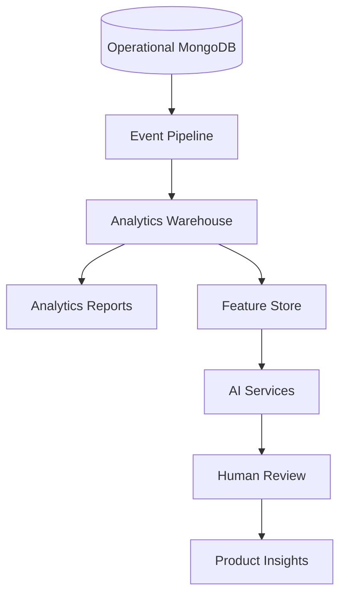
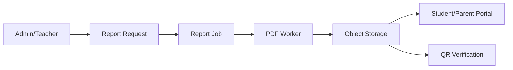

# Phase 10 - Future Features

Goal: prepare Smart M Hub for advanced modules, reporting, notifications, mobile apps, integrations, analytics, and AI without disrupting current school operations.

## Recommendations

| ID | Recommendation | Priority | Reason | Expected Benefit | Effort | Risk | Dependencies | DB Migration | Frontend Changes | Backend Changes | Downtime |
|---|---|---|---|---|---|---|---|---|---|---|---|
| FUT-01 | Add notification abstraction for in-app, SMS, email, and push | High | Notifications need reliable multi-channel delivery | Better communication workflows | Medium | Medium | Queue workers | Yes | Yes | Yes | No |
| FUT-02 | Add webhook framework for third-party integrations | Medium | Future integrations need signed reliable callbacks | Safer ecosystem expansion | Medium | Medium | API keys, queue | Yes | Admin UI later | Yes | No |
| FUT-03 | Add server-side official PDF/report rendering | High | Official reports need consistent output | Professional reporting | High | Medium | Queue, object storage | Yes | Yes | Yes | No |
| FUT-04 | Add report artifact storage, QR verification, checksums, and digital signature metadata | High | Published reports need verification and immutability | Trustworthy records | Medium | Medium | FUT-03, object storage | Yes | Yes | Yes | No |
| FUT-05 | Add CBC template versioning and immutable published snapshots | High | CBC changes over time must not alter old reports | Curriculum future-proofing | Medium | Medium | CBC module stability | Yes | Yes | Yes | No |
| FUT-06 | Model senior school pathways, tracks, optional subjects, and learner selections | Medium | Senior school CBC requires richer structure | Better compliance | High | Medium | Template versioning | Yes | Yes | Yes | No |
| FUT-07 | Add mobile API standards and offline-friendly sync design | Medium | Future Android/iOS apps need stable APIs | Mobile readiness | Medium | Medium | API versioning/pagination | Possible | No current web change | Yes | No |
| FUT-08 | Add event logging foundation and learner timeline | High | Analytics and AI need clean historical events | Better reporting and future AI | Medium | Medium | Audit taxonomy | Yes | Possible timeline UI later | Yes | No |
| FUT-09 | Add analytics warehouse and data dictionary plan | Medium | Predictive analytics should not run on operational DB | Safer analytics scale | High | Medium | Event foundation | Yes/external | No initially | Yes/export jobs | No |
| FUT-10 | Define module blueprint for transport, hostel, library, clinic, payroll, HR, procurement, LMS, and marketplace | Medium | Future modules need consistent architecture | Faster expansion | Medium | Low | Refactor guidelines | No | No | Docs/scaffolding | No |

## Future Architecture

## Reporting Flow

## Acceptance Criteria

- Notification delivery is queued, retryable, and audited.
- Official report artifacts are stored immutably.
- CBC template updates do not mutate historical reports.
- Mobile API guidelines are documented before native app work begins.
- Future modules follow a shared blueprint.
